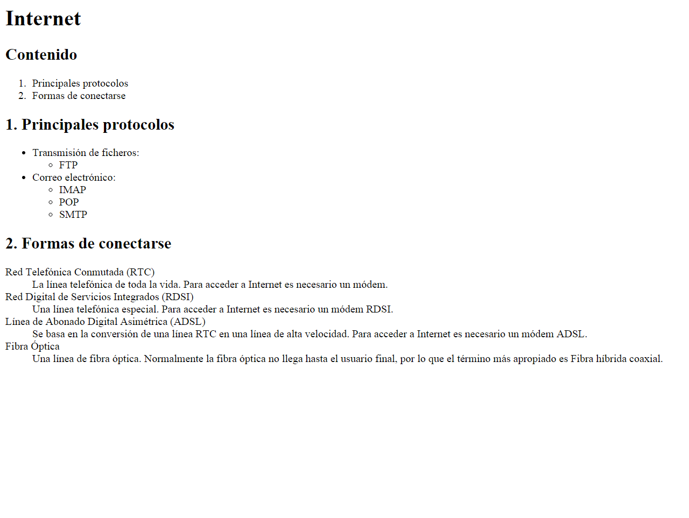

# Ejercicios - Listas 2

[link ejercicio listas 2](http://desarrolloweb.dlsi.ua.es/libros/html-css/ejercicio-listas-2)

Debes crear una página web que tenga el mismo aspecto que la siguiente imagen:

Selecciona para cada lista el mejor tipo de lista.