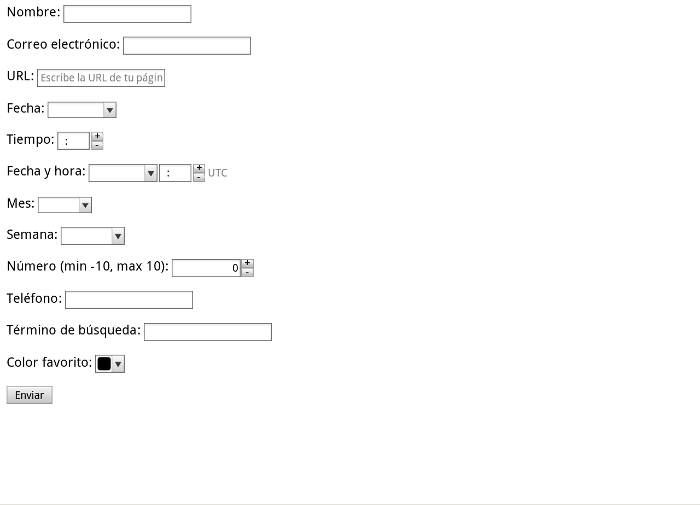

# Ejercicios - Formularios 3

[link ejercicio formularios 3](http://desarrolloweb.dlsi.ua.es/libros/html-css/ejercicio-formularios-html5)

Crea una página web que contenga un formulario con los siguientes campos de información:

* Nombre, con un control de tipo texto obligatorio y con autofoco.
* Correo electrónico, con un control de tipo email obligatorio.
* URL, con un control de tipo url que muestre la ayuda "Escribe la URL de tu página web personal".
* Fecha, con un control de tipo date.
* Tiempo, con un control de tipo time.
* Fecha y hora, con un control de tipo datetime.
* Mes, con un control de tipo month.
* Semana, con un control de tipo week.
* Número, con un control de tipo number que limite la entrada a un valor entre -10 y 10.
* Teléfono, con un control de tipo tel.
Término de búsqueda, con un control de tipo search.
* Color favorito, con un control de tipo color.
* Un botón de envío.

Además, tienes que tener en cuenta los siguientes requisitos:

* El título de la página debe ser Formulario de prueba de HTML5.
* El método de envío del formulario debe ser GET.
* El destino del envío del formulario debe ser "get.html".

**Nota 1:** Si al validar el código HTML de tu página web con el validador del W3C se muestran mensajes de advertencia como The date input type is not supported in all browsers. Please be sure to test, and consider using a polyfill. no te preocupes, el validador te está avisando de que lleves cuidado al usar una característica de HTML5 que no está admitida por todos los navegadores actuales.

**Nota 2:** Por lo anterior, cuando realices esta actividad y compruebes cómo se visualiza tu página web en distintos navegadores es muy probable que obtengas diferentes resultados.

Debes crear una página web que tenga el mismo aspecto que la siguiente imagen:

