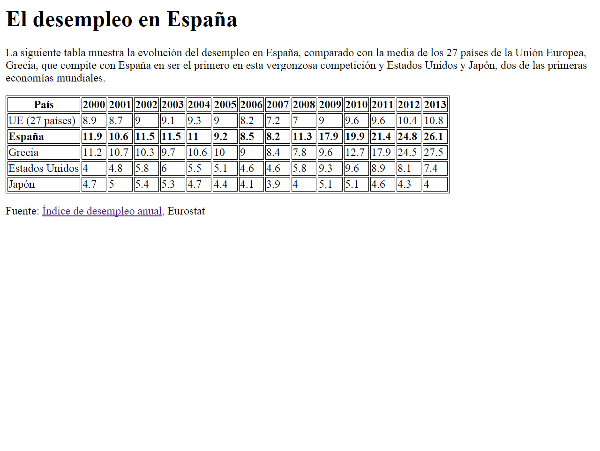

# Ejercicios - Tablas 1

[link ejercicio tablas 1](http://desarrolloweb.dlsi.ua.es/libros/html-css/ejercicio-tablas-1)

A partir del texto que se te proporciona, debes crear una página web que tenga el mismo aspecto que la siguiente imagen:



Además, tienes que tener en cuenta los siguientes requisitos:

* El destino del enlace Índice de desempleo anual es la página web:
  https://es.wikipedia.org/wiki/Desempleo_en_Espa%C3%B1a

**Nota:** En el código base que se te proporciona vas a encontrar una etiqueta nueva, la etiqueta ```<style>```. Esta etiqueta permite introducir instrucciones de CSS (Cascading Style Sheets) en una página web. CSS se emplea para definir la presentación visual de una página web y se explica en la segunda parte de este curso. Las instrucciones que se han incluido tienen como objetivo que la tabla y las celdas de la tabla se muestren con un borde. Esto también se podría haber logrado con el atributo border de HTML, pero es mejor utilizar siempre CSS para todo lo relacionado con la presentación de una página web.

## Código Base:
```
<!DOCTYPE html>
<html>
<head>
<title>Desempleo</title>
<style>
table, tr, th, td {
  border: 1px solid black;
}
</style>
</head>
<body>

El desempleo en España


La siguiente tabla muestra la evolución del desempleo en España, comparado con la media de los 27 países de la Unión Europea, Grecia, que compite con España en ser el primero en esta vergonzosa competición y Estados Unidos y Japón, dos de las primeras economías mundiales.


País
2000
2001
2002
2003
2004
2005
2006
2007
2008
2009
2010
2011
2012
2013


UE (27 países)
8.9
8.7
9
9.1
9.3
9
8.2
7.2
7
9
9.6
9.6
10.4
10.8


España
11.9
10.6
11.5
11.5
11
9.2
8.5
8.2
11.3
17.9
19.9
21.4
24.8
26.1


Grecia
11.2
10.7
10.3
9.7
10.6
10
9
8.4
7.8
9.6
12.7
17.9
24.5
27.5


Estados Unidos
4
4.8
5.8
6
5.5
5.1
4.6
4.6
5.8
9.3
9.6
8.9
8.1
7.4


Japón
4.7
5
5.4
5.3
4.7
4.4
4.1
3.9
4
5.1
5.1
4.6
4.3
4


Fuente: Índice de desempleo anual, Eurostat

</body>
</html>
```